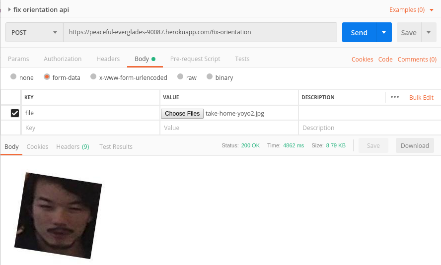

# Rotated face
Auto rotate image web api with PCN (Progressive Calibration Networks)
This project is implement PCN from [repo](https://github.com/siriusdemon/pytorch-PCN)
& this [paper](https://arxiv.org/pdf/1804.06039.pdf)

### Getting Started
```
$ docker-compose build
$ docker-compose up
```
### Deployment api
Postman: https://documenter.getpostman.com/view/2148815/S1LsYA7y

<div align="center">
  <br><br>
</div>
